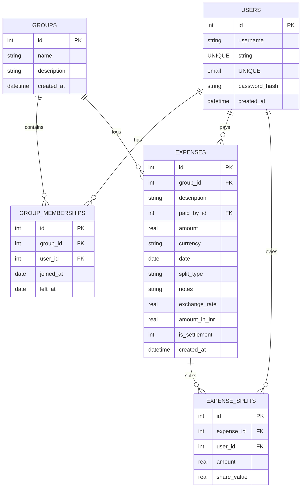

# SCOPE.md - Database Schema & Anomaly Log

This file contains the relational database schema design and the detailed anomaly log documenting the 14+ deliberate data problems identified in `Expenses Export.csv` and how the application detects and resolves them.

---

## 1. Database Schema (SQLite)

The application utilizes a relational SQLite database with strict foreign key constraints. Below is the relational structure:

### Table Definitions

*   **`users`**: Stores user profiles. Seeded with Aisha, Rohan, Priya, Meera, Sam, Dev, and Kabir (with password `password123`).
*   **`groups`**: Logical grouping of members. The default group `Flatmates` (ID `1`) holds the group state.
*   **`group_memberships`**: Tracks the membership timeline for each user with `joined_at` and `left_at` fields. This is crucial for verifying that expenses logged outside of active timelines trigger warnings.
*   **`expenses`**: Stores each transaction. Currencies are normalized into INR. Direct debt payments and deposits are logged with `is_settlement = 1`.
*   **`expense_splits`**: Relational join table mapping who owes what. Calculated share amounts are stored in INR, while original percentages/shares are saved in `share_value` for audit purposes.

---

## 2. Anomaly Log (Deliberate CSV Problems & Policies)

We detected **25 distinct anomalies** belonging to **14 distinct categories** in the `Expenses Export.csv` file. 

| # | Anomaly Type | Row(s) | Description | Resolution Policy Chosen & Rationale |
|---|---|---|---|---|
| **1** | **Duplicate Entries** | Row 5 & 6 | Dinner at Marina Bites logged twice (by Dev, ₹3,200). | **Policy:** The importer detects duplicate dates, amounts, and descriptions. It displays both entries side-by-side and prompts the user to select which entry to delete. Row 6 is deleted; Row 5 is kept. |
| **2** | **Conflicting Log (Double Entry)** | Row 24 & 25 | Aisha logged dinner at Thalassa (₹2,400) and Rohan logged Thalassa dinner (₹2,450). | **Policy:** Flags date overlaps with similar keyword descriptions and different payers/amounts. Prompts the user to select the correct entry. In accordance with Rohan's note ("Aisha's is wrong"), Row 25 is kept, and Row 24 is ignored. |
| **3** | **Inconsistent Date Format** | Row 27 | Date logged as "Mar-14" instead of "14-03-2026". | **Policy:** Parser translates non-standard formats (e.g. `MMM-DD`) into standard ISO format (`2026-03-14`) and surfaces the conversion in the import log. |
| **4** | **Ambiguous Date** | Row 34 | Date logged as "04-05-2026" with note "is this April 5 or May 4?". | **Policy:** Flagged as ambiguous since it breaks consecutive chronological order (surrounding rows are April). Wizard prompts the user to select the correct interpretation. Based on context, it resolves to **April 5, 2026** (`05-04-2026`). |
| **5** | **Name Casing & Formatting** | Row 9, 27 | Payer name logged as "priya" (lowercase) and "rohan " (trailing space). | **Policy:** Match names against canonical database profiles. Standardizes them to "Priya" and "Rohan" respectively. |
| **6** | **Alternative Name Format** | Row 11 | Payer name logged as "Priya S". | **Policy:** Fuzzy mapping identifies "Priya S" as "Priya". Prompts the user to confirm the mapping during validation. |
| **7** | **Missing Paid By** | Row 13 | "House cleaning supplies" (₹780) has blank payer field ("can't remember who paid"). | **Policy:** Blocks import until the user assigns a payer from the active group members dropdown in the wizard. |
| **8** | **Missing Currency** | Row 28 | "Groceries DMart" (₹2,105) has blank currency. | **Policy:** Flags empty currency. Wizard defaults it to "INR", allowing user overrides. |
| **9** | **USD vs INR Trip Spending** | Row 20, 21, 23, 26 | Trip expenses logged in USD (Villa, Beach lunch, Parasailing, Refund). | **Policy:** Blocks import until user specifies a conversion rate (prefilled with `83.0` INR per USD). The engine computes and stores the converted INR amount, keeping original currency data for reference. |
| **10** | **Settlement Logged as Expense** | Row 14, 38 | "Rohan paid Aisha back" (₹5,000) and "Sam deposit share" (₹15,000) logged as split expenses. | **Policy:** Identifies transaction descriptions with "paid back" or "deposit" and empty split types. Automatically imports them as direct settlement payments (Sender → Receiver, 100% split to receiver), bypassing normal expense splits. |
| **11** | **Negative Amount (Refund)** | Row 26 | "Parasailing refund" logged as "-30 USD" by Dev. | **Policy:** Interpreted as a refund. Splits the negative amount among participants, which credit balances and reduces what they owe Dev. |
| **12** | **Invalid Percentage Sum** | Row 15, 32 | Percentage split details sum to 110% (30% + 30% + 30% + 20%) instead of 100%. | **Policy:** Detects percentage sum mismatch. Normalizes percentages proportionally so they sum to exactly 100% (each participant's split = `percentage / total_percentage` of the total cost). |
| **13** | **Equal Split with Extra Details** | Row 42 | Split type is "equal" but "split_details" specifies shares (Aisha 1; Rohan 1; Priya 1; Sam 1). | **Policy:** Surfaces equal split mismatch. Wizard notes that split details are redundant and defaults splits equally among the split members. |
| **14** | **Zero Amount Record** | Row 31 | "Dinner order Swiggy" logged with amount 0 (note: "counted twice earlier"). | **Policy:** Flagged as zero expense. Prompt the user to ignore/delete (suggested) or import as a zero-value entry. Ignored during import. |
| **15** | **Timeline Violation (Departure)** | Row 36 | "Groceries BigBasket" on April 2 includes Meera, who moved out March 31. | **Policy:** Checks expense dates against membership timelines. Since April 2 is post Meera's leaving date, the wizard flags it and prompts the user to remove Meera. The split is redistributed equally among the remaining active members (Aisha, Rohan, Priya). |
| **16** | **Timeline Violation (Arrival)** | Row 39, 40 | "Housewarming drinks" (April 10) and "Electricity Apr" (April 12) include Sam, who moved in April 15. | **Policy:** Flags Sam's inclusion before his arrival date (April 15). The user can decide: for Housewarming drinks, Sam is kept in the split (since he was present for housewarming); for April electricity, Sam is removed, and the bill is re-split among Aisha, Rohan, and Priya. |
